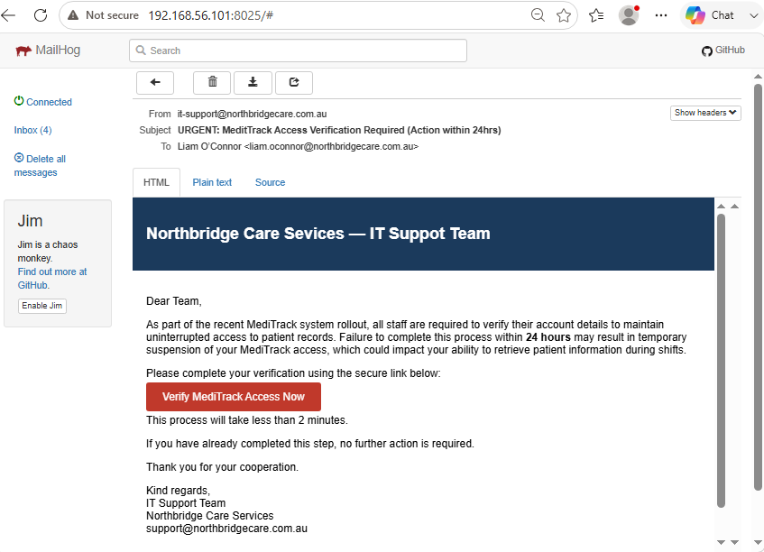

# Overview
This lab demonstrates a phishing attack simulation conducted in a controlled virtual lab environment. The objective was to simulate a real-world credential harvesting attack using GoPhish, while capturing user interaction and submitted credentials.
The lab showcases key offensive security concepts including:

- Social engineering through phishing emails
- Credential harvesting via a fake login portal
- User interaction tracking (email opens, clicks, submissions)
- Infrastructure setup across multiple VMs

# Objectives
- Configure a phishing simulation environment
- Design a realistic phishing email and landing page
- Deliver phishing emails using GoPhish
- Capture user credentials via a controlled attack
- Analyse user interaction data

# Lab Architecture
The lab environment consisted of the following components:
- Ubuntu VM (Attacker machine (GoPhish + Mail server))
- Windows VM (Victim machine)
- GoPhish (Phishing framework (email + landing page + tracking))
- MailHog (Email capture server)

# Network Configuration
Ubuntu VM:
192.168.56.101 (Host-only network)

Windows VM:
192.168.56.104

This allowed communication between attacker and victim systems within an isolated network.

# Tools Used
- GoPhish – phishing campaign management and tracking
- MailHog – SMTP email testing
- VirtualBox – lab environment
- Custom HTML landing page – credential harvesting interface

# Phishing Email Design
A phishing email was created to mimic an internal IT security notification, requesting users to verify their MediTrack account.
Key social engineering elements:

- Authority: IT Support Team branding
- Urgency: “24 hours to verify”
- Fear: potential loss of system access
- Realism: corporate formatting and tone

# Landing Page Development
A realistic login page was designed to replicate an internal staff portal.
Key features:

- Username and password fields
- Professional UI styling
- Security messaging (TLS, compliance labels)
- Credential submission form

# Phishing Campaign Execution
1. Phishing email sent via GoPhish 
2. Email received in MailHog (Windows VM)
3. User clicked phishing link
4. Landing page loaded with unique tracking ID
5. Credentials entered and submitted
6. GoPhish captured user data

# Results
GoPhish successfully tracked:

✅ Email delivery
✅ Email opens
✅ Link clicks
✅ Credential submissions

Captured data included:

- Username
- Password
- Timestamp
- User interaction data

# Key Learnings
- Modern phishing attacks rely heavily on social engineering rather than technical exploits
- Small configuration errors (e.g., form actions, network routing) can break attack chains
- Realistic UI design significantly increases credibility
- GoPhish requires simple HTML forms for reliable credential capture

# Ethical Considerations
This lab was conducted in a controlled, isolated environment for educational purposes only.
No real systems, users, or credentials were targeted.

# Conclusion
This lab successfully demonstrated a complete phishing attack lifecycle:

- Email delivery
- User interaction
- Credential harvesting

The project highlights both the technical execution and the human factors involved in phishing attacks.

